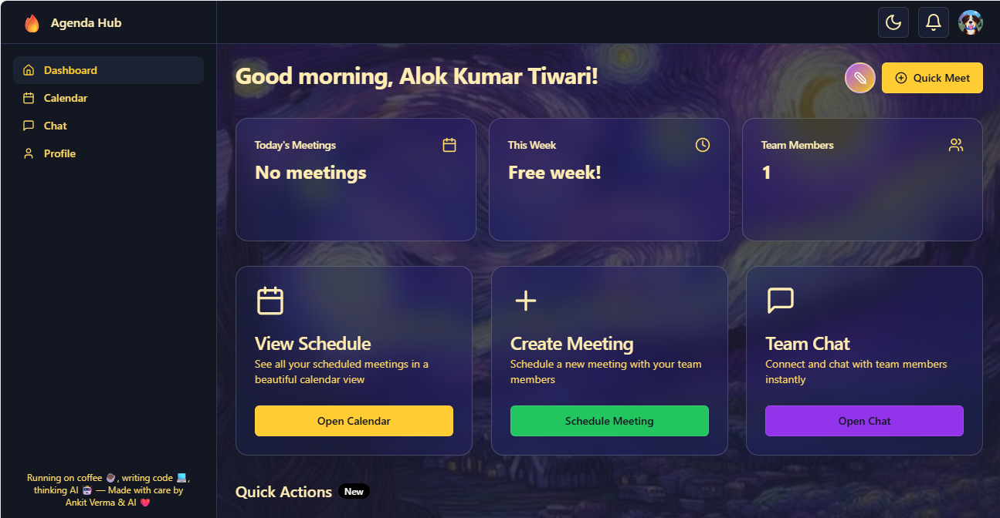

# 🚀 Agenda Unify Hub

[](https://agenda-hub-29cdf.web.app/)
[](https://github.com/eepanshu/Agenda_Hub)




A unified platform to manage meetings, notifications, chat, and user profiles across multiple platforms. Built for productivity and seamless collaboration.

---

## ✨ Features
- 📅 Calendar grid and meeting scheduler
- 💬 Real-time chat system
- 🔔 Notification center
- 👤 User profile management
- 🏷️ Platform filtering
- 🔒 Protected routes for secure access
- 📱 Responsive UI with shadcn-ui and Tailwind CSS

---

## 🖥️ Live Demo
Experience the app live: [Agenda Unify Hub](https://agenda-hub-29cdf.web.app/)

---

## 🛠️ Getting Started

### Prerequisites
- [Node.js & npm](https://nodejs.org/)

### Installation
```sh
# Clone the repository
git clone https://github.com/eepanshu/Agenda_Hub.git

# Navigate to the project directory
cd agenda-unify-hub-main

# Install dependencies
npm install

# Start the development server
npm run dev
```

---

## ⚙️ Technology Stack
- [Vite](https://vitejs.dev/)
- [React](https://react.dev/)
- [TypeScript](https://www.typescriptlang.org/)
- [shadcn-ui](https://ui.shadcn.com/)
- [Tailwind CSS](https://tailwindcss.com/)

---

## 🚀 Deployment (Render.com)
1. **Set the build and start commands:**
   - Build command: `npm run build`
   - Start command: `npm run preview`
2. **Static Site Option:**
   - Set the output directory to `dist` in Render.com settings.

---

## 🤝 Contributing
Contributions are welcome! Please open issues or submit pull requests for improvements and bug fixes.

---

## 📄 License
This project is licensed under the MIT License.

---

## 🔗 Repository
[GitHub - eepanshu/Agenda_Hub](https://github.com/eepanshu/Agenda_Hub)
